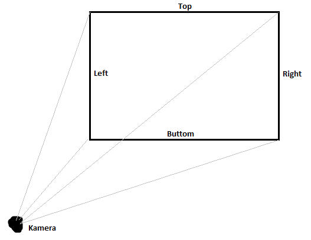
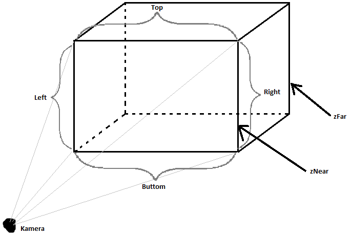

## Prevod z 2D od 3D
---
Objekty maju dalšiu os, ktorá určuje ako ďaleko sú od kamery. Treba však myslieť na to, že kamera je taktiež iba ďalší objek v scéne a dá sa s ňou hýbať rovnako ako s každým iným objektom.

### 2D
*`gluOrtho2D(left, right, top, buttom)`*
Vyvara obraz na ktorom vidime nase animacie.

### 3D
*`luOrtho(left, ritgh, top, buttnom, zNear, zFar)`*
Vytvara akoby kvader ktory kamera vidi. Pre nas to je trochu divne pochopit lebo nas *`zFar`* nemame lebo mame perspektivne videnie, cize nam by sa objekt iba zmensival. To vsak pre orthogonalnu projektiu neplati.

*`zNear`* nam urcuje rovinu od ktorej kamera zacina "vidiet" a *`zFar`* nam urcuje rovinu kam az "dovidi".

Tento obrazok je iba nepresna ukazka ako to ma vyzerat.

Pri svojich vypoctoch si odporucam vypocitat maxilne vzdialenosti ake gule dosiahne. a podla toho si urcovat parametre do *gluOrtho* aby si videl cely vrh.

## Vypocet

### X

> urcuje pohyb gule dolava alebo doprava

`velocity * cos(alfa) * sin(phi)`

### Y
>urcuje pohyb gule hore a dole

`velocity * sin(alfa) + 0.5 * ( gravity * ihod)`

### Z
>urcuje pohyb gule dozadu a dopredu

`velocity * cos(alfa) * cos(phi)`

---
**`alfa`** - je uhol pod ktorym bola gula hodena smerom hore a dole 

**`phi`** - uhol co urcuje do ktoreho kvadrantu gula poleti

**`ihod`** - je moje reprezentacie casu

Treba mysliet na to ze tieto vypocti su zavisle od casu. Cize ak musi vypocitane hodnoty pripocitavat k aktualnym hodnotam.
